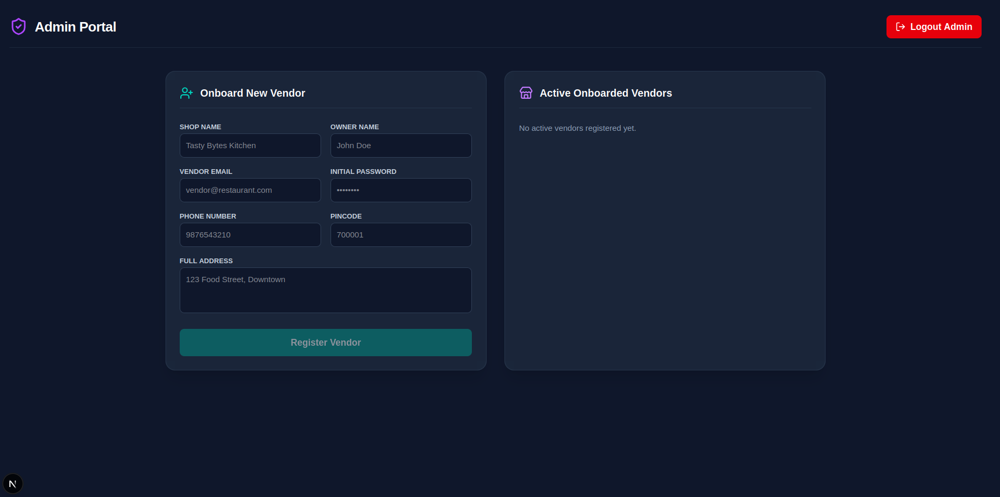

# 🍕 FoodFlow - Full-Stack Food Order Management Platform

A production-ready, modern **Full-Stack Food Delivery Platform** built with **Next.js 14+ (App Router)** on the frontend and **Express.js + Drizzle ORM (SQLite)** on the backend. Designed with high-performance type safety, state management (Redux + TanStack Query), and Clean Layered Architecture.

---

## 📱 Application Demo

<p align="center">
  
</p>

---

## 🏗️ Architecture Overview

The repository is structured with dedicated frontend and backend directories:

```text
food-order-management/
├── backend/                  # Node.js + Express + Drizzle ORM (SQLite)
│   ├── src/api/              # Controllers, Services, Repositories, Entities
│   ├── src/infrastructure/   # Drizzle Database Schemas & DAOs
│   └── package.json
├── frontend/                 # Next.js 14+ App Router Client
│   ├── src/app/              # Next.js Pages & Layouts
│   ├── src/providers/        # TanStack Query & Redux Providers
│   ├── src/store/            # Redux Toolkit Shopping Cart State
│   ├── src/lib/              # Axios API Client
│   └── package.json
└── docs/                     # Architecture & Full-Stack Roadmaps
```

---

## 🛠️ Tech Stack & Technologies

### **Frontend**
- **Framework:** Next.js (App Router, React 19)
- **State Management:** Redux Toolkit (Local Shopping Cart State)
- **Data Fetching & Caching:** TanStack Query (React Query v5)
- **API Client:** Axios
- **Icons & Styling:** Lucide React, Custom Modern Dark CSS

### **Backend**
- **Runtime & Language:** Node.js & TypeScript
- **Framework:** Express.js
- **Database:** SQLite (Local-first, fast relational persistence)
- **ORM:** Drizzle ORM (Lightweight & type-safe)
- **Authentication:** JWT (JSON Web Tokens) with RBAC (Role-Based Access Control)
- **File Storage:** Multer (For vendor shop and menu image uploads)

---

## ⚡ Key Features

- **Unified Identity Base (`Person`):** Single source of truth for authenticating Customers, Vendors, and Admins.
- **Clean Layered Architecture:** Decoupled Controllers, Services, Repositories, and Entities for maintainability.
- **Client & Server State Separation:**
  - **TanStack Query** handles backend API data fetching and cache invalidation.
  - **Redux Toolkit** handles local interactive cart badge state and item updates.
- **Role-Based Access Control (RBAC):** Middleware-protected API routes tailored for Admin, Vendor, and Customer personas.

---

## 🚀 Quick Start Guide

### 1. Prerequisites
- Node.js (v18 or higher)
- npm

### 2. Environment Setup
Create a `.env` file inside the `backend/` directory:
```env
PORT=8111
API_SECRET=your_jwt_secret_key
DATABASE_URL=sqlite.db
```

### 3. Run the Backend (Express API)
```bash
cd backend
npm install
npm run db:push    # Push Drizzle schema to SQLite database
npm run dev        # Starts server on http://localhost:8001
```

### 4. Run the Frontend (Next.js App)
```bash
cd frontend
npm install
npm run dev        # Starts client on http://localhost:3000
```

---


