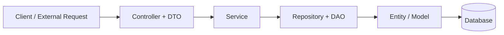

# Premium Food Order Management System

A production-ready, modular, and highly maintainable backend for a multi-persona food delivery platform. Built with a focus on Clean Architecture, type safety, and centralized resource management.

## 🚀 Overview

This project implements a robust backend for managing food orders, vendors, and customers. It features a sophisticated three-persona system (Admin, Vendor, Customer) powered by a unified identity foundation.

### Key Architectural Highlights
- **Unified Identity System**: Uses a shared `Person` entity for all personas, ensuring single-source logic for authentication, security, and credentials.
- **Clean Layered Architecture**:
    - **Entities**: Domain models with encapsulated business logic.
    - **Repositories**: Abstracted data access layer using Drizzle ORM.
    - **Services**: Pure business logic isolation.
    - **Controllers & DTOs**: Strict request/response validation and handling.
- **Centralized Response Engine**: A unified `callService` middleware handles all success/error responses consistently across the API.
- **Role-Based Access Control (RBAC)**: Secure middleware protecting routes based on persona permissions.



- Controller + DTO handle incoming requests and response shape.
- Service contains the business logic.
- Repository + DAO communicate with the database.
- Entity stores the core domain model that is persisted.


## 🛠 Tech Stack

- **Runtime**: Node.js & TypeScript
- **Framework**: Express.js
- **Database**: SQLite (Local-first, high performance)
- **ORM**: Drizzle ORM (Type-safe, lightweight)
- **Authentication**: JWT (JSON Web Tokens) with AuthPayload union types.
- **File Handling**: Multer for vendor shop and food image uploads.
- **Utility**: Bcrypt for high-security password hashing.

## 📊 Database Design

The project uses a relational schema optimized for SQLite:
- **Person**: Core credentials and common identity data.
- **Vendor**: Business-specific details linked to a Person ID.
- **Customer**: Profile data linked to a Person ID.
- **Food/Cart**: Managed relationship for order fulfillment.

## ⚙️ Setup & Installation

### 1. Prerequisites
- Node.js (v18+)
- npm

### 2. Environment Configuration
Create a `.env` file in the root directory:
```env
PORT=8001
API_SECRET=your_jwt_secret_key
DATABASE_URL=sqlite.db
```

### 3. Installation
```bash
npm install
```

### 4. Database Synchronization
Push the schema to your local SQLite database:
```bash
npm run db:push
```

### 5. Start Development Server
```bash
npm run dev
```

## 📜 Available Scripts

| Script | Description |
| :--- | :--- |
| `npm run dev` | Starts the server with `nodemon` for auto-reloading. |
| `npm run build` | Compiles TypeScript to production JavaScript. |
| `npm run start` | Runs the compiled application. |
| `npm run db:push` | Syncs `schema.ts` with the SQLite database. |
| `npm run db:studio` | Opens Drizzle Studio for visual database management. |

## 🏗 Project Structure

```text
src/
├── api/
│   ├── controller/   # Request handlers & Response formatting
│   ├── entity/       # Business domain entities (Rich Models)
│   ├── services/     # Core Business Logic
│   ├── repos/        # Data Access (Repository Pattern)
│   ├── dto/          # Data Transfer Objects & Interfaces
│   ├── middleware/   # Auth, Upload, and Response wrappers
│   └── utils/        # Auth helpers & Error classes
├── infrastructure/
│   ├── database/     # Drizzle schema & connectivity
│   └── daos/         # Physical data access objects
└── index.ts          # Application entry point
```

## 🧭 Architecture Overview

A simple diagram to explain the flow of the app:


